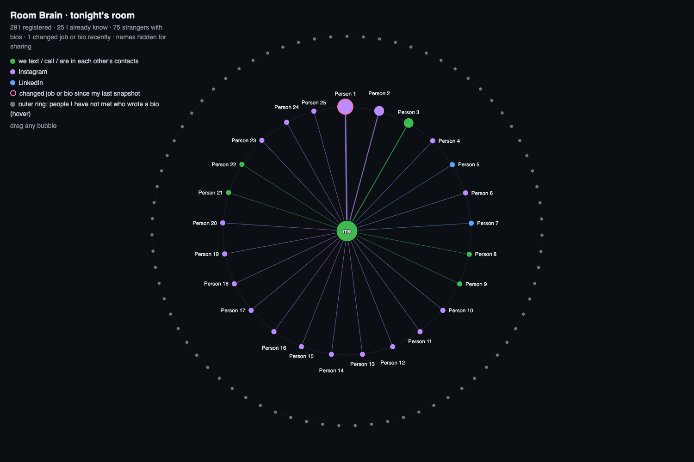
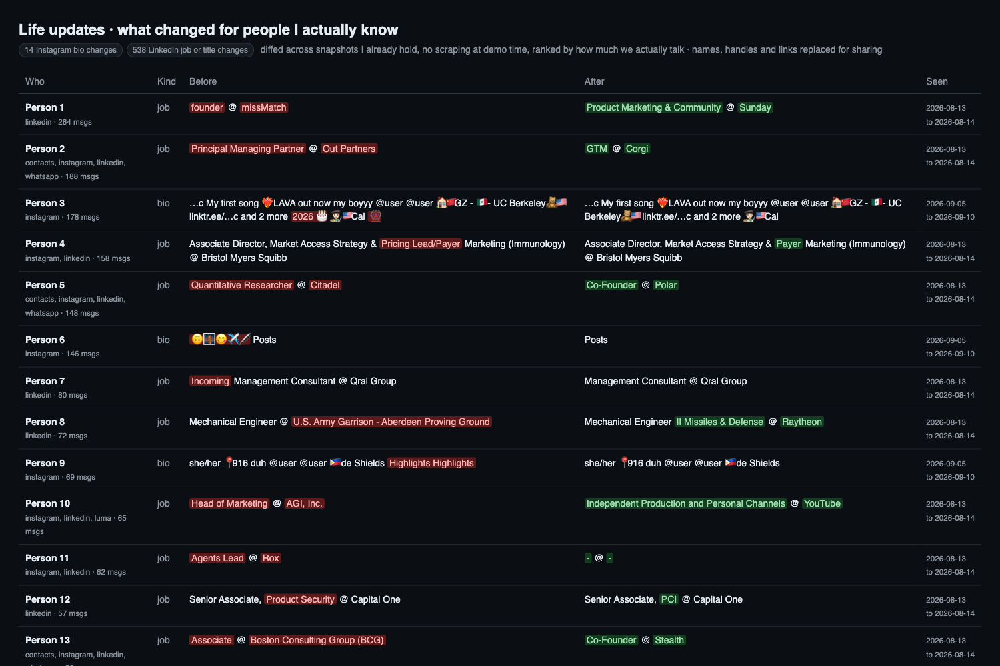
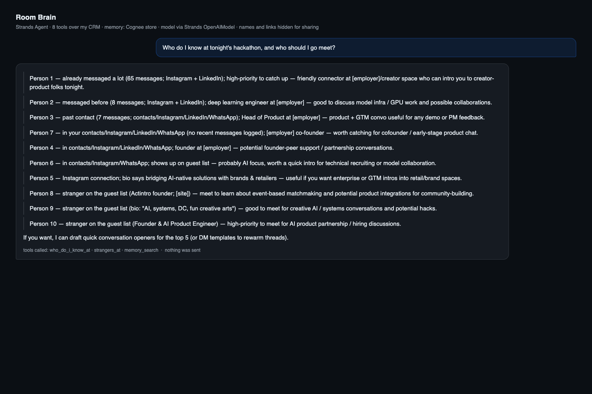

# Room Brain

**Instagram bio change tracking for your whole network**, plus a brain that knows who in the
room you already know.

You give it your Instagram export. It scrapes the public bio of every account you follow,
keeps every snapshot, and re-scrapes over time. When someone's bio changes (new job, new
city, new project, "she/her", a link), the brain notices, joins it to the same person's
LinkedIn and message history, and surfaces it ranked by how much you actually talk to them.
The same diff engine runs over LinkedIn `Connections.csv` exports for job and title changes.

Built in one evening at *Battle of the Personal Brains* (Bright Data SF, September 21, 2026),
on top of a personal CRM that already fuses eight of my own exports (Instagram, LinkedIn,
iMessage, WhatsApp, Gmail, Google Calendar, Contacts, Luma and Partiful guest lists) into one
identity graph of 50,135 people and about 173,000 evidence records.







## Measured tonight, on my own data

| | |
|---|---|
| Instagram accounts from my export with a scraped bio | 9,243 |
| of which re-scraped at least once so far | 425 |
| bio changes detected between snapshots | 159 |
| LinkedIn connections present in 2+ exports | 8,818 |
| job or title changes detected | 905 |
| people at tonight's hackathon (291 registered) I already know | 25 |
| strangers tonight who wrote a bio | 75 |

## What the agent does

1. **"What changed for the people I know?"** Bio and job diffs, first-vs-last snapshot per
   account, ranked by real message history. Rendered as a diff table
   (`brain/report.py`) and served to the agent as a tool (`life_updates`).
2. **"Who do I know at this event?"** A Luma guest list is imported and every guest is resolved
   against the identity graph on strong identifiers only (LinkedIn slug, Instagram handle,
   phone, email; a display-name match alone never counts). Rendered as a radial map
   (`brain/graph.py`).
3. **"Draft a note to X."** The agent drafts. It never sends. Its one write is a note into the
   CRM's human-judgment layer (`remember_note`), so the brain remembers what I decided.

## How the bio tracking works

```
Instagram export (following.json)
   -> scrape public profile pages (my instagram-tools scraper, or Bright Data Web Unlocker)
   -> every scrape is an immutable source_record (source=instagram, record_kind=profile_bio)
   -> re-scrape on a schedule; nothing is overwritten, snapshots accumulate
   -> brain/updates.py diffs first vs last snapshot PER ACCOUNT (two accounts of one person
      never read as a "change"), then joins each account to its canonical person
   -> ranked by messages exchanged and number of sources that know this person
```

Scraping public profiles is subject to Instagram's terms; this only touches accounts that are
already in my own export, at a slow rate.

## How each sponsor technology is used

**AWS Strands Agents, the harness.** `agent.py` builds `Agent(model, tools=[8 tools],
system_prompt, memory_manager=MemoryManager(stores=[RoomBrainMemory()], search_tool_config=True,
add_tool_config=True))`. The eight `@tool` functions wrap the brain: `list_events`,
`who_do_i_know_at`, `strangers_at`, `find_person`, `dossier`, `life_updates`, `enrich_url`,
`remember_note`. Strands' memory manager injects Cognee recall into every turn and hands the
model `memory_search` and `memory_add`. Model providers swap at runtime: `AnthropicModel`,
`OpenAIModel` (OpenAI direct or OpenRouter through `base_url`) and `OllamaModel` for a fully
local run; the demo ran on `gpt-5-mini` through Strands' OpenAI provider.

**Cognee, the memory.** `brain/memory.py` defines `RoomBrainMemory`, an implementation of
Strands' `MemoryStore` protocol whose backend is Cognee. Locally, `cognee.remember(lines,
dataset_name="room_brain")` built the graph from 99 fact lines about tonight's guests and the
recent life updates, and `cognee.recall(query, datasets=["room_brain"])` serves search. For
Cognee Cloud there is a REST client for the tenant's `add_text`, `cognify` and `search`
endpoints with `X-Api-Key` and `X-Tenant-Id`. A plain keyword backend is the fallback so a demo
never waits on a graph that is still building; `ROOM_BRAIN_MEMORY=cloud|local|plain` picks.

**Bright Data, the web.** `brain/web.py` `enrich_url()` posts to the Web Unlocker API
(`api.brightdata.com/request`, zone, raw format), strips the HTML and returns title,
`og:description` and text; `public_profile_summary()` enriches a stranger's first non-Instagram
link. The agent uses it to learn about strangers before recommending whom to meet, and it is the
intended path for re-scraping the 9,243 bios at scale. Every result says `via: brightdata` or
`via: direct`; a Web Unlocker zone (`web_unlocker1`) is live on the account and fetches return
`via: brightdata`. The direct fetch remains as a fallback if the key or zone is missing.

Claude, OpenAI or a local Ollama model is the LLM. Docker sandboxes were not used.

## Architecture

```
Instagram scrapes ───┐
LinkedIn exports ────┤   personal-crm  (sqlite: evidence → identities → people → derived → notes)
Luma guest list ─────┤
iMessage / WhatsApp ─┘
          │
   brain/updates.py     life_updates   first-vs-last snapshot diff, one timeline per account
   brain/crm_tools.py   who_do_i_know_at · strangers_at · find_person · dossier · remember_note
   brain/web.py         enrich_url      Bright Data Web Unlocker → direct fetch
   brain/memory.py      RoomBrainMemory Strands MemoryStore over Cognee (cloud | local | plain)
   brain/report.py      updates.html    word-level before/after diffs
   brain/graph.py       graph.html      radial map of the room
          │
   agent.py             Strands Agent + model + MemoryManager
```

Raw evidence is immutable, identities are observed (strong or weak), people are clusters of
identities with soft merges, derived tables can be dropped and rebuilt, and my own notes live in
a layer no machine writes to except through `remember_note`.

## Run

```bash
uv venv .venv
uv pip install --python .venv/bin/python "strands-agents[anthropic]" openai cognee requests rich -e ../personal-crm
cp .env.example .env               # keys; model key comes from your shell env
./run.sh -m brain.memory ingest    # facts about tonight's event + recent life updates → Cognee
./run.sh -m brain.report all 40    # data/updates.html
./run.sh -m brain.graph            # data/graph.html
./run.sh show_updates.py bio 15    # terminal table
./run.sh agent.py "Who do I know at tonight's hackathon, and who should I go meet?"
./run.sh agent.py "What changed in my network recently? Draft one congratulations note."
```

`ROOM_BRAIN_PROVIDER=anthropic|openai|openrouter`, `ROOM_BRAIN_MODEL`, `ROOM_BRAIN_MEMORY=cloud|local|plain`
and `ROOM_BRAIN_EVENT` override the defaults. The `crm` package comes from my personal-crm
project, which is being productized and is not in this repo.

## Rules the agent runs under

- Every name, employer, count and date comes from a tool result. Missing fields are reported
  as missing, never guessed.
- People I have actually messaged rank above weak matches.
- No outbound actions. Drafts only.
- Private data never enters the repo: `.env`, `data/`, the database and the memory files are
  gitignored.

## Is anyone else doing this? (checked, not assumed)

Searched on September 21, 2026. Per-account Instagram bio trackers exist:
[instagram_monitor](https://github.com/misiektoja/instagram_monitor) and
[instatracker](https://github.com/ibnaleem/instatracker) on GitHub, and consumer apps such as
[IG Tracker](https://igtracker.app/), [InstaRadar](https://www.instaradar.app/) and
[Stalk AI](https://play.google.com/store/apps/details?id=com.socialscan.app). Bulk follower
exporters that include bios also exist ([IGFollow](https://chromewebstore.google.com/detail/igfollow-follower-export/pkafmmmfdgphkffldekomeaofhgickcg),
[Instalab](https://instalab.ai/ig-follower-export-tool), [DolphinRadar](https://www.dolphinradar.com/ig-follower-export-tool)),
and Dex sells job-change alerts for LinkedIn.

What I did not find: a tool that re-scrapes the bios of everyone you follow, diffs them over
time, and fuses the result with your LinkedIn and message history into one person record so
the changes are ranked by relationships you actually have. That is the claim this project
makes, and only that. The search was two queries, not exhaustive.
